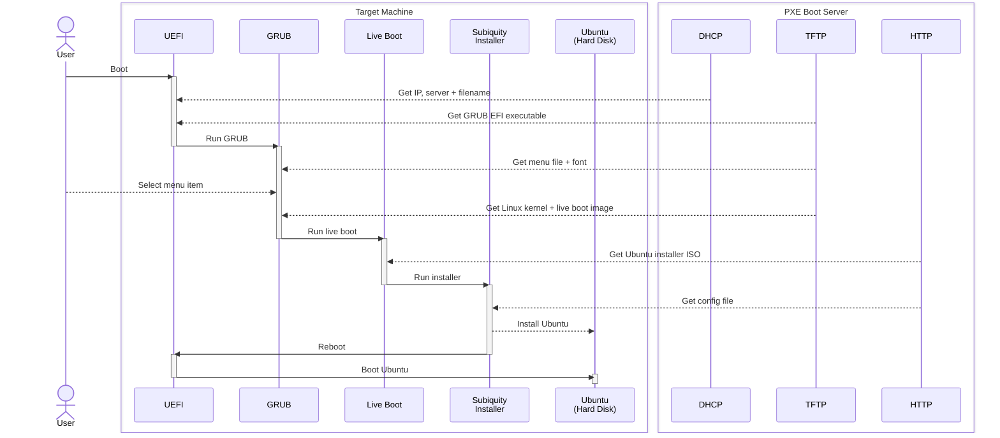

# Using PXE boot to install Ubuntu over the network

My goal here is to replicate what we have set up at work - a system for automating the installation of ubuntu onto various machines over the network.

## How it works

1. The target machine (whether physical or VM) is set up, PXE (*"pixie"*) boot is enabled, and it is started.
2. UEFI looks for a [DHCP server](https://en.wikipedia.org/wiki/Dynamic_Host_Configuration_Protocol) on the local network. The DHCP server assigns the machine an IP address, and tells it where to download the [EFI executable](https://krinkinmu.github.io/2020/10/11/efi-getting-started.html) for [GRUB](https://www.gnu.org/software/grub/).
3. UEFI downloads GRUB using the [TFTP](https://en.wikipedia.org/wiki/Trivial_File_Transfer_Protocol) protocol. and then executes it.
4. GRUB downloads a menu file (and a font) using TFTP, and presents the menu to the user.
5. The user selects an entry such as "Install Ubuntu 22.04".
6. GRUB downloads the Linux kernel (`vmlinuz`) and live boot image (`initrd`) from the TFTP server, and then runs it. It passes it the URLs of an [ISO image](https://en.wikipedia.org/wiki/Optical_disc_image) of [Ubuntu Server installer](https://ubuntu.com/download/server) and an [autoinstall (YAML) file](https://ubuntu.com/server/docs/install/autoinstall-reference).
7. The live boot image downloads the full ISO file over [HTTP](https://en.wikipedia.org/wiki/HTTP) and runs it, which starts the Subiquity installer.[^liveboot]
8. Subiquity downloads the autoinstall file, then installs Ubuntu using the configuration provided.
9. At the end of the install, the system reboots.
10. At the next boot, either:
    1. The hard disk has higher priority, so Ubuntu is booted directly; or
    2. PXE boot happens as above, but "Boot from Local Disk" is selected from the menu, and Ubuntu is booted by GRUB.

### Graphical version



## Test network

If you have an existing DHCP server (which is very likely), and don't want to replace it or disrupt existing devices, I recommend setting up a separate network just for testing. You will also need internet access, so you will probably need two network interfaces per VM - one for local communication between test VMs (used for DHCP, TFTP, HTTP), and one for access to the internet and the rest of the local network.

In a live environment, you would either configure your main DHCP server to do this, or have a separate network that you can connect to as-and-when needed (whether physically with a cable, or by adjusting the hypervisor settings).

## PXE boot server setup

We will need at least one VM to act as our DHCP/TFTP/HTTP server - although we could split the services across multiple VMs (or physical servers) if needed (e.g. in a large network).

### (Virtual) hardware requirements

The boot server has very modest requirements. I used:

- 2 vCPUs
- 2 GB RAM
- 20 GB disk

But you could probably get away with less if needed.

[^ram]: Determined by trial-and-error - YMMV. This could be reduced after installation is complete, if you want to.

You will also need a test machine. It will need at least 4 GB of RAM (4096 MB)[^ram] to hold the installer image - otherwise it will probably fail to run. The same is true for all machines you intend to install Ubuntu on in the future. Other operating systems may have different requirements.

### Directory structure

Just for reference, this is the directory structure we will be creating:

```
/etc
└── dhcpd
    └── dhcpd.conf

/srv/tftp
├── efi
│   ├── grubx64.efi
│   └── shimx64.efi
├── grub
│   ├── fonts
│   │   └── unicode.pf2
│   └── grub.cfg
└── ubuntu-22.04
    ├── initrd
    └── vmlinuz

/var/www/html
└── ubuntu-22.04
    ├── standard-configuration.yaml
    └── ubuntu-22.04.2-live-server-amd64.iso
```

You can move most of these files around to suit your own preferences, as long as you update the relevant config files (e.g. `/etc/default/tftpd-hpa`, `/etc/apache2/sites-available/000-default.conf`, and the ones listed below).

### DHCP server

[^dhcp]: A possible alternative is [Dnsmasq](https://dnsmasq.org/), which also provides TFTP and DNS, but ([according to Wikipedia](https://en.wikipedia.org/w/index.php?title=Comparison_of_DHCP_server_software&oldid=1140911896)) doesn't support load-balancing or failover. Wikipedia also lists [a few other options](https://en.wikipedia.org/wiki/Comparison_of_DHCP_server_software).

I will be using [ISC DHCP Server](https://help.ubuntu.com/community/isc-dhcp-server), to match what we use at work. However, it is [no longer maintained](https://www.isc.org/blogs/isc-dhcp-eol/) (EOL), as of Oct 2022, so is probably not the best choice[^dhcp] for a new setup!

Install it:

```bash
sudo apt install isc-dhcp-server
```

Then edit the configuration file:

```bash
sudoedit /etc/dhcp/dhcpd.conf
```

Replace it with something like [this file](etc/dhcp/dhcpd.conf) (the key parts being `option architecture-type code ...` and the last few lines).

Then restart the DHCP server to apply the changes, and check that it is working:

```bash
sudo systemctl restart isc-dhcp-server
sudo systemctl status isc-dhcp-server
```

It should output something like:

```
● isc-dhcp-server.service - ISC DHCP IPv4 server
     Loaded: loaded (/lib/systemd/system/isc-dhcp-server.service; enabled; vendor preset: enabled)
     Active: active (running) since Mon 2023-05-29 15:40:29 BST; 30ms ago
```

You can ignore a message such as:

```
Mar 26 12:12:29 pxe dhcpd[3294]: No subnet declaration for eth1 (192.168.39.14).
Mar 26 12:12:29 pxe dhcpd[3294]: ** Ignoring requests on eth1.  If this is not what
Mar 26 12:12:29 pxe dhcpd[3294]:    you want, please write a subnet declaration
Mar 26 12:12:29 pxe dhcpd[3294]:    in your dhcpd.conf file for the network segment
Mar 26 12:12:29 pxe dhcpd[3294]:    to which interface eth1 is attached. **
```

Assuming `eth1` is the NAT network, not the test network - we want it to ignore that one.

#### Test DHCP

At this stage, you could try booting a test machine to check that it is correctly allocated an IP address. It won't actually be able to boot yet, because there is no server to connect to, and will give an error such as:

```
NBP filename is efi/shimx64.efi
NBP filename is 0 Bytes
PXE-E99: Unexpected network error.
```

You will also be able to see it in the DHCP server logs by running:

```bash
journalctl --lines 100 --follow --unit isc-dhcp-server
```

[^dups]: There was a bit more output than this - I removed some superflous / duplicate lines.

It should output something like:[^dups]

```
Mar 26 12:15:38 boot dhcpd[1442]: DHCPDISCOVER from 00:15:5d:ea:01:0e via eth0
Mar 26 12:15:39 boot dhcpd[1442]: DHCPOFFER on 192.168.5.200 to 00:15:5d:ea:01:0e via eth0
Mar 26 12:15:42 boot dhcpd[1442]: DHCPREQUEST for 192.168.5.200 (192.168.5.4) from 00:15:5d:ea:01:0e via eth0
Mar 26 12:15:42 boot dhcpd[1442]: DHCPACK on 192.168.5.200 to 00:15:5d:ea:01:0e via eth0
```

### TFTP and HTTP servers

[^apache]: You may want to do something more complicated with the web server - such as adding other virtual hosts, adding HTTPS, using PHP to generate config files dynamically, or using a completely different web server such as [Nginx](https://nginx.org/) or [Caddy](https://caddyserver.com/) - but that is out of scope for now.

We will need both TFTP and HTTP (web) servers to serve files. These are quite simple to set up:[^apache]

```bash
sudo apt install tftpd-hpa apache2
```

#### Test TFTP

Now you can reboot the test machine and check that it is connecting to the TFTP server. Of course, there is nothing for it to download yet, but the error message should be different - e.g.

```
NBP filename is efi/shimx64.efi
NBP filename is 0 Bytes
PXE-E23: Client received TFTP error from server.
```

If you would like to, you can also enable verbose logging on the TFTP server. First, edit the config file:

```bash
sudoedit /etc/default/tftpd-hpa
```

And change this line:

```bash
TFTP_OPTIONS="--secure"
```

To:

```bash
TFTP_OPTIONS="--secure -vvv"
```

Then restart the server:

```bash
sudo systemctl restart tftpd-hpa
```

And watch the logs next time you reboot the test machine:

```bash
journalctl --lines 100 --follow --unit tftpd-hpa
```

[^rrq]: I had to restart TFTP a couple of times before this worked. Not sure why. Maybe I missed something the first time...

It should output something like:[^rrq]

```
Mar 26 12:30:31 boot in.tftpd[2827]: RRQ from 192.168.5.200 filename efi/shimx64.efi
Mar 26 12:30:31 boot in.tftpd[2827]: sending NAK (1, File not found) to 192.168.5.200
```

Remember to turn verbose logging off afterwards.

### GRUB binaries

[^copy]: Unfortunately, you [can't use symlinks](https://stackoverflow.com/questions/24046293/accessing-a-symlink-over-tftp#comment37086892_24047078) to get automatic updates, because TFTPD won't follow them outside its root directory.

[^sudo]: I'm assuming you will need to use `sudo` here. I normally change the directory ownership instead.

DHCP passes control to GRUB - the *GRand Unified Bootloader*. We can copy[^copy] that from our local Ubuntu install:[^sudo]

```bash
sudo mkdir /srv/tftp/efi
sudo cp /usr/lib/shim/shimx64.efi.signed /srv/tftp/efi/shimx64.efi
sudo cp /usr/lib/grub/x86_64-efi-signed/grubnetx64.efi.signed /srv/tftp/efi/grubx64.efi
```

Note that there are two files required:

- `shimx64.efi` is [signed by Microsoft](https://askubuntu.com/a/342382/29806), and contains Canonical's public key
- `grubx64.efi` is signed by Canonical, and contains GRUB itself

That allows new versions of GRUB to be released by Canonical (Ubuntu) without needing Microsoft to sign every release individually.

If you disable Secure Boot instead, you could use `grubx64.efi` directly - even the unsigned version. If you run into problems, it may be worth doing that temporarily, to rule out signing/verification issues.

Also note that we have to copy `grubnetx64.efi`, not `grubx64.efi`. I assume it contains additional code required for netbooting. We have to rename it to `grubx64.efi`, because that is what `shimx64.efi` looks for.

Finally, many tutorials recommend getting `grubnetx64.efi.signed` directly from the [Ubuntu archive](http://archive.ubuntu.com/ubuntu/dists/jammy/main/uefi/grub2-amd64/current/) - but that doesn't contain a copy of `shimx64.efi`, and I couldn't get it to work with the local copy of `shimx64.efi`. If you disable Secure Boot, however, the version in the archive works fine.

#### Test GRUB

[^minimal]: In my case at least, the PXE boot output and the Hyper-V logo were still visible underneath, making it quite hard to read!

At this point, you should be able to reboot the test machine and get to a GRUB prompt:[^minimal]

```
Minimal BASH-like line editing is supported. For the first word, TAB
lists possible command completions. Anywhere else TAB lists possible
device or file completions.

grub>
```

Not very user-friendly yet, but we're getting there!

### GRUB menu

Now let's create a menu file.

```bash
sudo mkdir /srv/tftp/grub
sudoedit /srv/tftp/grub/grub.cfg
```

Copy [this file](srv/tftp/grub/grub.cfg). It configures three menu entries:

- "Boot from Local Disk" assumes that Ubuntu is already installed on the local hard disk, and boots it. This won't work yet, but it will be required after it is installed, in case PXE boot is higher priority than local booting. This is the default, auto-selected after 10 seconds, so that the machine can be booted without manual intervention.
- "Install Ubuntu ... Standard Configuration" will install Ubuntu without any intervention, using the standard configuration that we're going to define later.
- "Install Ubuntu ... Manual Installation" will start the Ubuntu installer, then prompt the user for the rest of the configuration (the same as installing from a regular ISO or disc).

We also need to copy the font referenced above:

```bash
sudo mkdir /srv/tftp/grub/fonts
sudo cp /usr/share/grub/unicode.pf2 /srv/tftp/grub/fonts/unicode.pf2
```

#### Test GRUB menu

At this point, you should be able to reboot the test machine, get to the GRUB menu, and select an entry.

But none of the entries will actually work yet, because we don't have anything to run...

### Download Ubuntu live server ISO

We're going to skip a step now - the reason will become clear in a moment - and download the [Ubuntu Server ISO](https://ubuntu.com/download/server) into the web server root:

```bash
sudo mkdir /var/www/html/ubuntu-22.04
sudo wget https://releases.ubuntu.com/22.04.2/ubuntu-22.04.2-live-server-amd64.iso -O /var/www/html/ubuntu-22.04/ubuntu-22.04.2-live-server-amd64.iso
```

The file is 1.8 GB, so it will take some time to run.

#### Test HTTP

There's no point rebooting the test machine at this point, because it still doesn't know how to download that file.

But you can check the HTTP server is working by running this on the boot server:

```bash
curl -I http://192.168.5.4/ubuntu-22.04/ubuntu-22.04.2-live-server-amd64.iso
```

It should output something like:

```
HTTP/1.1 200 OK
Date: Sun, 26 Mar 2023 12:51:50 GMT
Server: Apache/2.4.52 (Ubuntu)
Last-Modified: Fri, 17 Feb 2023 21:57:18 GMT
ETag: "75c6f000-5f4ec65a00b80"
Accept-Ranges: bytes
Content-Length: 1975971840
Content-Type: application/x-iso9660-image
```

### Live boot image

Next, we need to extract a couple of files from the ISO. They are:

- `vmlinuz` - The Linux kernel (`z` indicates it is compressed)
- `initrd` - The Initial RAM Disk that bootstraps the system

Together, they will allow the system to actually boot.

```bash
# Mount the ISO
sudo mkdir /mnt/iso
sudo mount /var/www/html/ubuntu-22.04/ubuntu-22.04.2-live-server-amd64.iso /mnt/iso

# Copy the files from it
sudo mkdir /srv/tftp/ubuntu-22.04
sudo cp /mnt/iso/casper/vmlinuz /srv/tftp/ubuntu-22.04/
sudo cp /mnt/iso/casper/initrd /srv/tftp/ubuntu-22.04/

# Unmount the ISO
sudo umount /mnt/iso
sudo rmdir /mnt/iso
```

#### Test manual installation

At this point, the "Manual Installation" option should be fully working. You can use it to install Ubuntu on the test machine, if you want, and then you can use "Boot from Local Disk" to boot it.

If that's all you wanted it to do, you can even stop here. (You would probably want to edit the GRUB menu and remove the "Standard Configuration" option though.)

If you try to run the "Standard Configuration" option though, it will attempt to download `standard-configuration.yaml`, fail, and then take you to the regular manual installer.

#### Passwords

To generate the password hash under `identity`:

```bash
# Yes, 'whois' is the correct package name!
sudo apt install whois
mkpasswd -m sha512crypt
# enter the password and press enter
```

#### Network

You may notice that I have specified a static IP address for the internal network, rather than using DHCP. That is so I can use that IP in my DNS records, and it will keep working even if the DHCP server is not available. This works fine, as long as the IP address for each server is unique, and they do not overlap with the range of IPs that the DHCP server allocates.

If you are setting up a permanent DHCP server, you will probably want to register the fixed IP addresses in `/etc/dhcp/dhcpd.conf` instead:

```nginx
host test {
    hardware ethernet 00:15:5d:ea:01:0e;
    fixed-address 192.168.5.101;
}
```

You can find the MAC address in Hyper-V > Networking tab > Hyper-V Internal Network. Alternatively, run `ip addr` on the server itself (look under `eth0`, since it's the first network adapter). Again, the IP should be within the subnet range, but [outside](https://serverfault.com/a/768679/76878) the dynamically allocated range.


